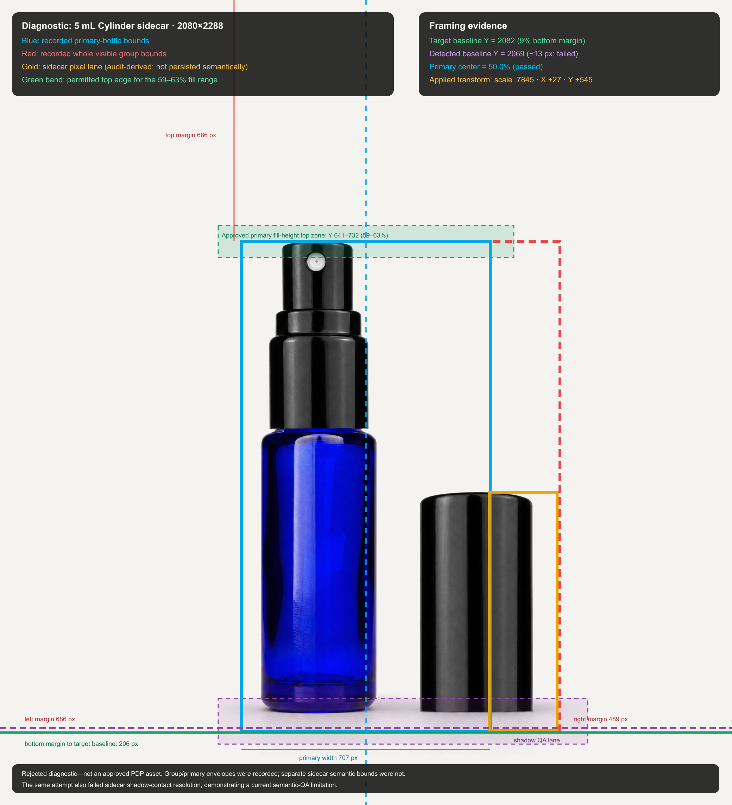
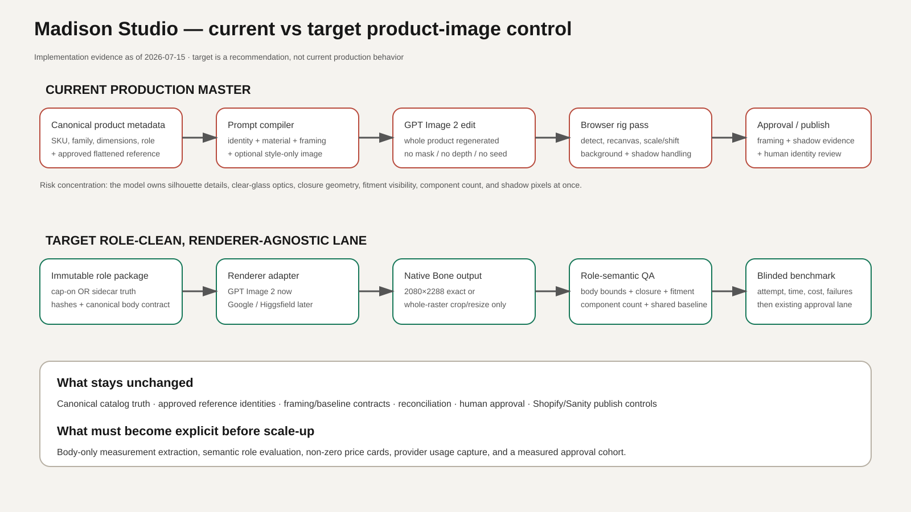

# Madison Studio image pipeline — implementation evidence report

**Evidence date:** 2026-07-15  
**Repository:** `madison-app`  
**Scope:** Best Bottles Cylinder production-master lane, browser rig, reconciliation/publish controls, and the renderer-agnostic material pilot.  
**Safety boundary:** This audit made no provider calls, uploads, database mutations, or production-code changes.

## Executive finding

Madison already has strong catalog truth, role-aware reference rules, a fixed 2080×2288 canvas, family framing contracts, reconciliation evidence, human approval, and controlled publishing. The recurring failures are not evidence that those systems are useless. They are evidence that the image model still owns too many product decisions at once.

The production Cylinder master is an OpenAI `gpt-image-2` image edit. It receives one flattened product-truth image, optionally one style-only material image, and a long prompt. It then regenerates the complete visible product—glass, closure, fitment, cap, internal tube, highlights, and shadow—in one flattened output. There is no provider mask, component layer stack, depth map, 3D geometry, seed, or deterministic closure compositor. The browser can subsequently detect a visible envelope, rescale/translate the whole raster, normalize background pixels, and evaluate framing/shadow heuristics. It cannot reliably repair a wrong cap, missing fitment, bad occlusion, or altered glass geometry.

The newer material pilot is the correct architectural direction but is not yet a catalog production replacement. It separates `cap-on` and `sidecar` roles, hashes references and canonical truth, records attempts, supports renderer adapters, checks native Bone borders, forbids post-generation background mutation, and keeps every attempt non-publishable. However, the current pilot stores body-scale QA as `measurement-required` because it does not yet extract and submit body-only bounds after rendering. Its semantic checklist is also human-review metadata, not automated vision. Recorded model comparison and cost-per-approved-image results therefore do not yet exist.

## 1. Current pipeline, from SKU to publish

```text
Canonical SKU truth + approved role-specific reference
  → Masters UI / request hook
  → precompiled identity/material/framing prompt
  → Supabase generate-madison-image Edge Function
  → OpenAI gpt-image-2 /v1/images/edits
  → raw PNG in generated-images storage + generated_images row
  → browser rig: detect bounds, normalize/translate/scale, shadow/framing QA
  → best_bottles_image_reconciliations
  → human identity/applicator/surface review
  → approved SKU-image link
  → existing single-use Shopify/Sanity publishing controls
```

| Stage | What the live implementation does | Evidence |
|---|---|---|
| SKU/product truth | Carries SKU, family, capacity, dimensions, color/material, applicator, cap state, topology, identity/truth status and provenance. | `src/components/darkroom/MastersTabPanel.tsx`; `src/hooks/useAssembledPromptGeneration.ts`; `best_bottles_pipeline_sku_jobs` migrations |
| Reference selection | Cylinder requires exactly one opaque flattened product-truth reference and permits at most one style-only reference. Background, mask/control and additional product refs are blocked. | `src/hooks/useAssembledPromptGeneration.ts`; `supabase/functions/generate-madison-image/index.ts` |
| Prompt assembly | Combines catalog canon, product identity, family rig, clear-glass/material language, shadow ownership, and visual-target calibration. | `src/config/bestBottlesCatalogCanon.ts`; `src/lib/bestBottlesPromptPreflight.ts`; `src/config/bestBottlesVisualTarget.ts` |
| Model request | Best Bottles reference-locked master is forced to OpenAI `gpt-image-2`, high quality, PNG, opaque, 2080×2288; references route to `/v1/images/edits`. | `supabase/functions/generate-madison-image/index.ts`; `supabase/functions/_shared/openaiProvider.ts` |
| Raw result | Uploads returned bytes to the public `generated-images` bucket and writes `generated_images`. | `supabase/functions/generate-madison-image/index.ts`; `generated_images` migrations |
| Browser rig | Detects foreground, primary lane, baseline and center; can normalize Bone pixels and resample/translate the complete raster; then evaluates framing and shadow. | `src/lib/product-image/rigPostprocess.ts`; `src/lib/product-image/framingQa.ts`; `src/lib/product-image/shadowQa.ts` |
| Reconciliation | Stores prompt/reference/catalog hashes, raw/final URLs, transforms, bounds, framing/shadow evidence and lifecycle state. | `supabase/migrations/20260710090000_best_bottles_image_reconciliation.sql`; `20260712001000_best_bottles_model_shadow_evidence.sql` |
| Approval/publish | Requires machine evidence and manual identity, applicator and surface/crop checks before approved linkage/publish. | `src/lib/bestBottlesImageReconciliation.ts`; reconciliation/publish migrations and Edge Functions |

There is no durable queue in the normal master path; the browser holds the function request open. The material pilot adds an attempt ledger, but it is isolated and explicitly non-publishable.

## 2. Product-truth requirements

The canonical geometry source is `docs/best-bottles-canonical-truth/best-bottles-master-truth.csv` (SKU truth) plus `best-bottles-body-geometry.csv` (family × size body truth). Geometry keys on the body, not the SKU. `heightWithoutCap` is a body constant; `heightWithCap` is closure/variant-specific.

| Field | Current source | Current status/use |
|---|---|---|
| SKU / website SKU | canonical master CSV; pipeline jobs | Required identity/linkage |
| Family, capacity | canonical master CSV | Required for profile/scale |
| Canonical body height | `canon_bodyHeightMm` / body geometry | Required by material scale contract |
| Canonical width/diameter | `canon_widthAxisMm`; never raw flat-family diameter | Required by material scale contract |
| Assembled height | `canon_heightWithCapMm` | Variant-specific; required by scale contract |
| Neck finish | canonical master CSV / PDP evidence | Prompt/truth metadata; not pixel-enforced |
| Bottle material/color | canonical fields and product context | Prompt and human truth review |
| Applicator/closure | catalog/product context | Prompt, role and topology gates |
| Cap state | explicit `cap-on` or `sidecar` lane | Required; must not share identity references across roles |
| Cap color/finish | catalog text/context; sometimes inferred from SKU/description | Inconsistent structured coverage; prompt/human review |
| Component count/topology | role/topology context | Prompt gate; semantic count is not automated in production |
| Product reference URL/hash | reconciliation/pilot manifest | URL is active; hash is strong in reconciliation/pilot, uneven in legacy rows |
| Source dimensions/provenance | reference-production manifests and product context | Available for prepared references; inconsistent across older imports |
| Prompt/rig/shadow versions | prompt record, library tags, reconciliation | Persisted in modern lane |

Missing or weakly normalized fields are a component graph (body, collar, actuator, cap, tube, roller), per-component dimensions, depth order, and a uniformly structured cap finish. These are not reasons to invent values; they are blockers or human-review obligations.

## 3. Material-master authority

The intended authority split exists in prompt and reference order:

- **Image 1 / product truth:** sole authority for silhouette, proportions, closure, hardware, topology, component count, color, centerline and baseline.
- **Image 2 / style only:** glass clarity/depth, wall/base appearance, refraction, highlight rhythm, premium finish, lighting, Bone tone and restrained shadow style.

`useAssembledPromptGeneration.ts` inserts the product ref first and optional style ref second. `bestBottlesVisualTarget.ts` explicitly forbids the style image from changing silhouette, family, closure, applicator, color, scale, crop, geometry, composition or components. The Edge Function enforces one product ref and at most one style ref.

This is **language-level authority separation**, not pixel-level separation. OpenAI receives two flattened images plus text. There is no mask or component-specific conditioning that technically prevents the style image from influencing geometry. The authority model is well specified but not mechanically isolated.

## 4. Canvas and bounding-box mechanics

### Current constants and thresholds

| Control | Current value |
|---|---|
| Master canvas | 2080×2288, exact 10:11 (`src/config/productImageDimensions.ts`) |
| Canonical/pilot Bone | `#F5F3EF` |
| Current visual-target/browser-rig Bone | `#F6EFE8` |
| Baseline | 9% from canvas bottom; Y≈2082 on 2288 px |
| Centerline | 50% width; X=1040 |
| Center tolerance | ±2.5 percentage points |
| Baseline warning/failure | warning beyond ±4 px; failure beyond ±8 px |
| Fill tolerance | profile range plus 0.5 percentage point |
| Hard normalization reject | fill more than 12 points outside target range |
| Width ceiling | profile `fillWidthPct`; Cylinder/product profiles are generally 60–62% |
| Detached primary detection lane | X≈12–70% of canvas |
| Sidecar placement prompt | right side; shared baseline within ~6 px; 6–10% canvas-width gap |

The product-specific profile is resolved by `getBestBottlesFamilyProfileForProduct()` and `getFamilyRigForProduct()`. It can override generic Cylinder values with capacity/height bands and derives a body target from canonical body/assembled measurements.

`detectStrongBounds()` samples every second pixel and treats RGB distance ≥52, or pale foreground distance ≥16, as product signal. `detectPrimaryBottleBounds()` restricts this to the left/central bottle lane for detached topology. There is no equally durable production `detachedCapBounds` field: the full group and primary bottle are stored, while sidecar contact segmentation is heuristic and can be missing.

`computeRigFrameTransform()`:

1. Computes desired scale from target fill height divided by detected baseline-to-top height.
2. Applies correction only when the difference exceeds 2.5%, unless scale preservation is requested.
3. Caps scale to 0.5–2.5 and additionally obeys width and canvas-air limits.
4. Translates Y to the target baseline.
5. Translates X so the primary bottle—not the bottle+sidecar group—is centered.
6. Suppresses tiny moves (≤8 px) in specific cases.

The complete canvas is drawn through `drawImage()` at the computed scale/translation. Therefore the whole raster—including glass, cap, shadow and any artifacts—is resampled together. If foreground or baseline cannot be detected, framing QA fails; the fallback returns a reviewable image rather than inventing geometry.

### Representative diagnostic



This is a rejected 5 mL sidecar attempt, chosen because it has a complete recovery record. The recorded transform was scale `0.7845`, X `+27`, Y `+545`. Primary center passed at 50%; detected baseline Y=2069 missed target Y=2082 by −13 px. The system stored whole-group and primary bounds but not a reliable semantic sidecar box; sidecar shadow-contact bounds were also missing. That limitation is shown rather than hidden.

## 5. Native Bone versus paint-after

There are currently two distinct behaviors:

1. **Production browser rig:** the model is instructed to render Bone natively, but `prepareUnmaskedRigRecanvasPixels()` can still blend background-like source pixels toward a target Bone and `drawImage()` can resample the full raster. Mask-controlled and deterministic-shadow branches can also alter pixels. Comments correctly state that broad global color correction was retired because it washed out clear glass, but post-generation background normalization remains.
2. **Material pilot:** requires native Bone border QA, stores `background_mutated=false`, and permits only whole-raster center crop/resize for non-native aspect providers. It does not paint around the product. `evaluateNativeBoneCanvas()` fails mean channel error >8 or any channel error >24.

There is also a confirmed Bone-token split: canonical catalog/pilot code uses `#F5F3EF`, while the approved visual-target reference and browser rig use `#F6EFE8`. The immediate recommendation is to choose one signed token and make prompt, renderer request, QA, rig and publishing validation consume it. For the requested architecture, the final background should be generated natively; a failed native-background check should reject the attempt, not trigger paint-around repair.

## 6. Premium-look requirements: enforced versus requested

| Requirement | Code/QA enforced? | Current reality |
|---|---:|---|
| Exact canvas, baseline, center, fill band | Yes | Deterministic measurement/normalization |
| Flat Bone border | Pilot yes; production partly | Production can normalize pixels; two Bone tokens exist |
| Correct cap state/reference role | Input gate yes | Output topology still needs human review |
| Clear/cobalt/amber/frosted identity | Prompt + catalog truth | No automated material classifier |
| Metal roller / exact cap identity | Prompt + human review | No semantic component detector |
| No extra components | Prompt + human review checklist | No automated count in production/pilot |
| Premium glass clarity, depth, refraction | Prompt/style image only | Model-generated |
| Wall/base thickness appearance | Prompt/style image only | Model-generated |
| Soft short contact shadow, camera-right | Prompt + heuristic shadow QA | Geometry/semantics can still be wrong |
| No floor/horizon/props/heavy cast | Prompt; limited pixel heuristics | Human review remains necessary |
| No cloudy glass/dark side rails | Prompt only | No formal optical QA classifier |
| No altered geometry | Canonical bounds/framing checks only | Closure/body details can drift inside a passing envelope |

## 7. Deterministic versus generative responsibility

| Element | Current owner | Recommended owner |
|---|---|---|
| Bottle geometry | Primary ref + generative model | Deterministic canonical body package; model may relight, not redesign |
| Dimensions | Canon data + framing heuristics | Canonical signed body/assembled contract + measured body-only QA |
| Canvas placement | Prompt then browser whole-raster rig | Server-side deterministic transform recipe |
| Cap/roller identity | Reference/prompt/model + human review | Role-specific immutable component truth + semantic QA |
| Component count | Prompt/model + human review | Role manifest + automated count/topology check + human approval |
| Glass appearance | Model, guided by style-only ref | Controlled model material enhancement from approved material master |
| Background | Model plus possible browser normalization | Native renderer output; deterministic border QA; reject, never paint around |
| Lighting | Model | Model within approved family/material calibration |
| Shadow | Model or rig policy, then heuristics | One declared owner per lane; native model shadow with topology QA or deterministic compositor, never both |
| Framing QA | Browser pixel heuristics | Shared server/browser implementation with persisted body/sidecar bounds |
| Semantic product QA | Mostly human | Automated role/material/closure/component checks plus human sign-off |

## 8. Confirmed causes of inconsistency

### Confirmed by code or artifacts

- Cap-on and sidecar are distinct roles, but historical references/outputs were not consistently role-clean. A cap-off image cannot be the identity source for a cap-on lane.
- The provider regenerates the entire flattened product; it does not merely relight a preserved product layer.
- OpenAI master calls send no seed, mask, edge/depth control, component layers or geometry lock.
- Transparent glass and internal hardware have no semantic depth ordering.
- Production post-processing can act on and resample the full raster.
- Framing QA measures envelopes, not cap identity, fitment correctness, glass optics or component count.
- Prompt/version drift exists across catalog canon, visual target, older local CLI and historical artifacts.
- Bone is configured as both `#F5F3EF` and `#F6EFE8`.
- Legacy `generated_images` does not provide a complete attempt/cost ledger. The material pilot does, but only for pilot attempts.
- A saved rejected Cylinder artifact shows wrong baseline after normalization and unresolved sidecar shadow-contact bounds.
- The material pilot currently creates `framing_qa` with `bodyBounds=null`; body-scale acceptance is not automated yet.

### Plausible but not proven fleet-wide

- The optional style reference may sometimes influence closure geometry despite prompt prohibitions.
- Low-resolution flattened sources likely increase pump/tube disappearance and cap reconstruction errors.
- Repeated retries may improve some outputs by chance, but no evidence shows reliable convergence.

## 9. Material-pilot status and benchmark evidence

The pilot schema is substantial and correctly isolated:

- `best_bottles_material_pilot_runs`
- `best_bottles_material_pilot_attempts`
- `best_bottles_material_pilot_reviews`

Attempts store renderer/model/endpoint, immutable reference manifest, full prompt and hashes, canonical truth/hash, request parameters, raw/final URLs and hashes, transform recipe, native Bone/framing/shadow/semantic QA, failure reasons, estimated/actual cost fields, duration and code/function versions. All pilot outputs are forced `publish_eligible=false` and `background_mutated=false`.

Renderer registry:

| Renderer | State | Model | Output handling |
|---|---|---|---|
| OpenAI | Active | `gpt-image-2` | Native exact 2080×2288 |
| Google | Active adapter | `models/gemini-3.1-flash-image-preview` | 1:1 2K then whole-raster center crop/resize |
| Higgsfield | Future placeholder | unconfigured | No execution |

Observed evidence is insufficient for comparative approval rates. Repository records show at least one OpenAI pilot attempt completing in about 130.989 seconds with native Bone passing; estimated cost was zero and actual cost was null. Zero is an unpriced price card, not free generation. No approved human review was recorded, so approval rate and cost per approved image are presently **not computable**.

## 10. Phased implementation plan

### Immediate gate before another paid batch

1. Emit one signed role-specific source manifest per SKU/role.
2. Choose one canonical Bone token and eliminate the `#F5F3EF`/`#F6EFE8` split.
3. Make client/server/pilot reference validation consume the same rules.
4. Route every paid attempt through the attempt ledger, including failed/gateway attempts.
5. Emit one prompt-manifest version and persist the exact sent prompt/reference order.
6. Extract body-only and sidecar bounds after rendering; persist them and run scale QA.
7. Implement role-specific semantic QA inputs instead of storing only a human checklist.
8. Surface the annotated bounds overlay in review UI.
9. Populate a non-zero versioned price card and record provider-native usage/request IDs.

### Controlled Cylinder material-master pilot

Use a small signed cohort spanning clear, cobalt, amber, frosted, cap-on, sidecar, roller and visible internal hardware. Each attempt receives:

```text
exact role-specific SKU product reference
+ approved family/material master
+ canonical body and assembled geometry contract
+ role/topology rules
+ premium material instructions
```

Run at least two attempts per role/renderer, blind review them, and report first-pass approval, final approval, failure reasons, median/P90 duration, native-Bone pass rate, estimated and actual cost per approved image. Do not promote pilot images directly; approved results must enter existing reconciliation.

### Medium term

- Create component-aware packages: bottle, closure/fitment, detached cap, tube/roller and material metadata.
- Move framing/transform measurement to a reproducible server-side recipe shared with the browser.
- Add semantic checks for closure identity, component count, fitment visibility, glass material and role topology.
- Keep 3D deferred until these controls prove insufficient; do not build full 3D now.

## 11. Current versus target architecture



## 12. Exact files and database surfaces inspected

### Implementation

- `src/config/productImageDimensions.ts`
- `src/config/productImageEnvironment.ts`
- `src/config/imagePresets.ts`
- `src/config/bestBottlesCatalogCanon.ts`
- `src/config/bestBottlesVisualTarget.ts`
- `src/config/bestBottlesFamilyProfiles.ts`
- `src/config/bestBottlesCatalogScale.ts`
- `src/lib/bestBottlesPromptPreflight.ts`
- `src/lib/product-image/familyRig.ts`
- `src/lib/product-image/framingQa.ts`
- `src/lib/product-image/rigPostprocess.ts`
- `src/lib/product-image/shadowQa.ts`
- `src/hooks/useAssembledPromptGeneration.ts`
- `supabase/functions/generate-madison-image/index.ts`
- `supabase/functions/_shared/openaiProvider.ts`
- `supabase/functions/_shared/familyRig.ts`
- `supabase/functions/_shared/bestBottlesMaterialPilot.ts`
- `supabase/functions/_shared/bestBottlesMaterialPilotRenderer.ts`
- `supabase/functions/generate-bestbottles-material-pilot/index.ts`

### Canonical/data evidence

- `docs/best-bottles-canonical-truth/BEST-BOTTLES-CANONICAL-TRUTH.md`
- `docs/best-bottles-canonical-truth/best-bottles-master-truth.csv`
- `docs/best-bottles-canonical-truth/best-bottles-body-geometry.csv`
- `tmp/best-bottles-reference-production/cylinder-dual-role-remediation-v2/.../recovery-record.json`
- `tmp/best-bottles-reference-production/cylinder-material-pilot-v2/*.json`
- `docs/BEST_BOTTLES_COST_AND_TIME_AUDIT_2026-07-15.md`

### Database/storage surfaces

- `generated_images`
- `best_bottles_pipeline_sku_jobs`
- `best_bottles_image_reconciliations`
- `best_bottles_pipeline_sku_images`
- `best_bottles_material_pilot_runs`
- `best_bottles_material_pilot_attempts`
- `best_bottles_material_pilot_reviews`
- Supabase Storage bucket `generated-images`

## 13. Unresolved questions

1. Which Bone is final: canonical `#F5F3EF` or visual-target `#F6EFE8`?
2. Which exact source manifest is authorized for each Cylinder SKU × role, and are all hashes immutable and remotely available?
3. Who supplies/reviews body-only and sidecar bounds: deterministic CV, operator markup, or both?
4. What provider price card and usage units should be considered authoritative?
5. Has the Google adapter been deployed and successfully exercised in the same environment, or is it code-ready only?
6. Which shadow owner is final per role: native model or deterministic rig? Mixed ownership must remain prohibited.
7. What minimum pilot cohort and approval threshold authorizes a Cylinder batch?
8. Which semantic failures are absolute rejects versus human-overridable warnings?
9. Should the public `generated-images` bucket remain public for immutable product references and benchmark evidence, or should signed URLs be required?
10. Which legacy outputs/references should be archived once role-clean manifests are authoritative?

## 14. Stakeholder-ready email section

**Subject: Madison Studio catalog-image pipeline status and production gate**

Madison now has the core systems needed to organize a repeatable catalog: verified product measurements, role-specific references, fixed canvas and baseline rules, image evidence, human approval, and controlled publishing. The reason the recent images have still varied is that the AI is currently asked to rebuild the entire visible product—including glass, cap, fitment, internal hardware, lighting, and shadow—from a flattened reference. A beautiful single result can happen, but it does not prove that the same product will be reconstructed correctly across hundreds of SKUs.

We are correcting this by separating responsibilities. Product identity and measurements remain fixed by the catalog and the exact SKU reference. A material master may influence only glass quality, highlights, lighting, background tone, and restrained shadow treatment. The model generates the premium material treatment, while Madison measures the body, baseline, center and role topology and rejects anything that drifts. Every paid attempt will also be logged with its model, references, prompt, time, failures and cost.

Before catalog-wide generation, we need to finish four gates: unify the Bone background token, complete immutable cap-on and sidecar manifests, automate body/sidecar measurement and semantic role checks, and run a blinded Cylinder benchmark with real approval and cost data. Once those pass, the existing approval and publishing controls can safely carry approved images into the website.

## 15. Presentation-image prompts

These are creative briefs only; no provider image was generated during this audit.

### Old overloaded workflow

> Create a clean editorial systems illustration on a warm off-white background. At left, show one flattened product photo of a clear glass perfume bottle with pump, dip tube, collar and cap. Feed it into one large glowing “AI” box crowded with labels: geometry, glass, cap identity, component count, background, lighting, shadow, crop. At right, show several subtly inconsistent outputs: changed cap height, missing tube, cloudy glass, extra cap and drifting baseline. Use restrained black, cobalt and muted red accents, precise arrows, premium consulting-presentation style, no playful cartoon look, 16:9.

### New structured Madison pipeline

> Create a premium technical editorial illustration on Best Bottles Bone. Show a left-to-right structured pipeline: signed SKU truth and role-specific product reference; separate style-only material master; renderer adapter; native 2080×2288 Bone output; measured body, primary bottle and sidecar bounding boxes; semantic QA checklist; human approval; controlled website publish. Make deterministic controls black/green, generative material treatment cobalt, and blocked failures muted red. Emphasize that geometry and topology remain fixed while glass clarity, lighting and restrained contact shadow are enhanced. Elegant, minimal, high-end consulting presentation, 16:9.

## Bottom line

Madison is close to a controlled benchmark, not yet ready for an unlimited Cylinder production run. The correct next milestone is not “generate more.” It is to close the signed-role manifest, Bone-token, body-bound measurement, semantic-QA and cost-ledger gaps, then prove the lane with a blinded representative Cylinder cohort.
