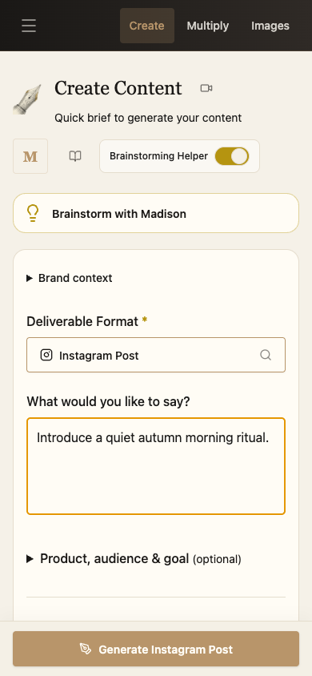

# Madison mobile workflow

Local implementation; no production deployment or database changes performed for this refactor.

## Design decisions

Madison's current parchment writing surfaces, serif headings, brass controls, and dark image workspace remain the visual reference. Refero research used Ghost (`54f1e370-5a3c-4cea-ad3e-ffa1501e741e`) for restrained editing hierarchy, Krea (`3a63b3fa-dc79-4dc3-935e-3f8f4ab447a7`) for putting the image ahead of controls, and Raycast's mobile editor (`214b4427-1d80-4cf7-91a3-e6c484369306`) for contained sheets with reachable actions. Their brand palettes and typography were not imported.

- Create: compact starters, visible writing brief, optional product/targeting and brand context disclosures, fixed primary action.
- Content editor: readable page padding, explicit Save and Multiply actions in a two-row toolbar, no keyboard forced open on entry.
- Multiply: labelled format checkboxes, full source reading/editing, reachable generation action, mobile visual prompt packs, and complete derivative editing.
- Image workspace: native click handling for touch, Return inserts a line break, accessible portalled settings/input/result sheets. Image Studio shows the result first and puts variation controls in a disclosure.
- Light Table: vertical layout, accessible controls, full-height refinement tools, horizontal session film strip instead of hiding images on phones.
- Shared: component-owned button widths, zoom enabled, visible-viewport sizing for keyboard overlays, safe-area padding, constrained scrollable dialogs.

## Verification

Run the local Vite server, then `MOBILE_BASE_URL=http://127.0.0.1:5186 node scripts/mobile-workflow/verify.mjs` (Playwright with installed Chrome).

The script seeds a synthetic session and intercepts all remote APIs. It exercises Create → Editor → Multiply, derivative editing, Dark Room error/retry/settings → Light Table, image prompt persistence/reference upload/generation/variation, and viewport widths 360/390/430/768/1024/1440. Images and generated text are fixtures; this is UI acceptance, not evidence of a live provider generation or production save. Screenshots go to the OS temporary directory `madison-mobile-qa`.

Physical iPhone Safari keyboard, native photo picker, native sharing, and live authenticated production flows need device verification after release. The Writing AI backend release remains separately pending; mobile changes preserve its local implementation.

## Verified locally

- Production frontend build passed (existing large-bundle warnings remain).
- Repository-wide TypeScript checking still fails on existing diagnostics. Comparing normalized diagnostics in modified files with the pre-mobile run found no new errors.
- Browser acceptance passed at six widths, plus a 390 × 400 short viewport for the image setup dialog. Create, editor save, Multiply text and visual prompts, same-tab image handoff, error/retry, reference upload, prompt persistence, image variation, download, save, and library editor all exercised with intercepted APIs.
- Writing AI settings regression passed: provider save/reload, key input cleared, no horizontal overflow at 390px. Its 27 backend unit tests also passed.
- Visual inspection caught and resolved tablet split panels, late-loaded Light Table CSS conflicts, and missing dark-theme color classes beyond simple page-overflow assertions.

Representative screenshots use synthetic content and an existing local reference photograph, not newly generated production work:

